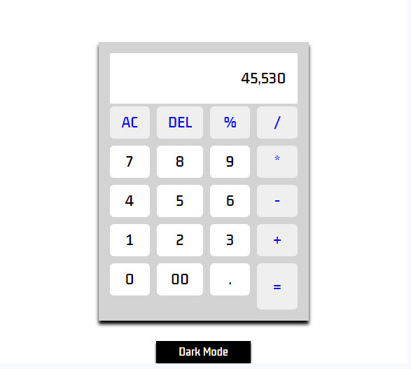
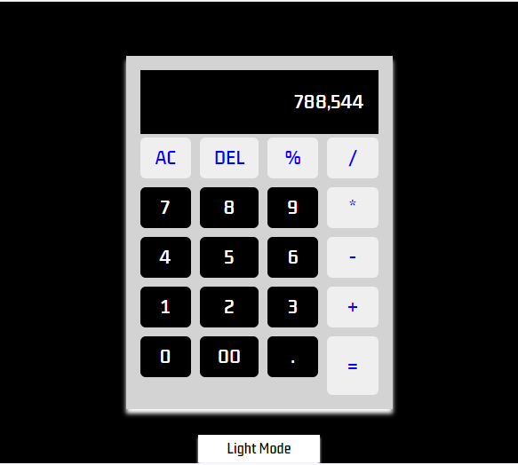

# Calculator App

A simple web-based calculator application with basic arithmetic operations and a toggle between light and dark modes.


## Table of Contents
- [Screenshots](#screenshots)
- [Features](#features)
- [Installation](#installation)
- [Usage](#usage)
- [Contributing](#contributing)
- [License](#license)

## Screenshots





## Features

- Perform basic arithmetic operations: addition, subtraction, multiplication, division, and modulus.
- Format numbers for better display.
- Toggle between light and dark modes for a personalized experience.

## Installation

1. **Clone the repository:**

    ```bash
    git clone https://github.com/your-username/calculator-app.git
    ```

2. **Open the project folder:**

    ```bash
    cd calculator-app
    ```

3. **Open the `index.html` file in your web browser.**

## Usage

- Use the calculator to perform basic arithmetic operations.
- Toggle between light and dark modes to customize your experience.


## Contributing

Contributions are welcome! If you'd like to contribute to the project, please follow these steps:

1. Fork the repository.
2. Create a new branch for your feature or bug fix.
3. Make your changes.
4. Commit your changes.
5. Push to your branch.
6. Create a pull request.

## License

This project is licensed under the [MIT License](LICENSE).
